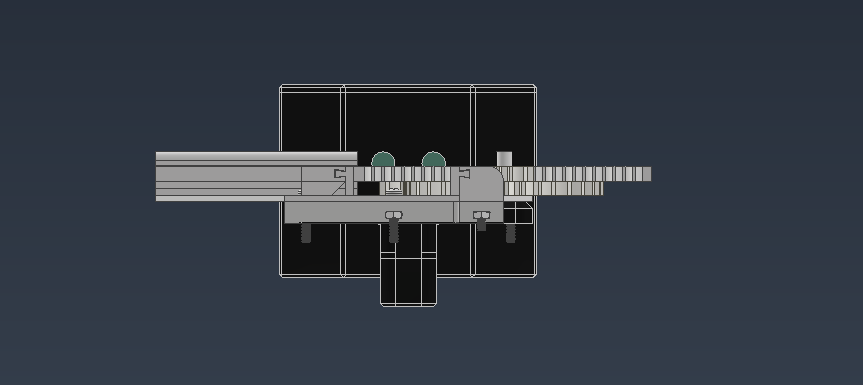
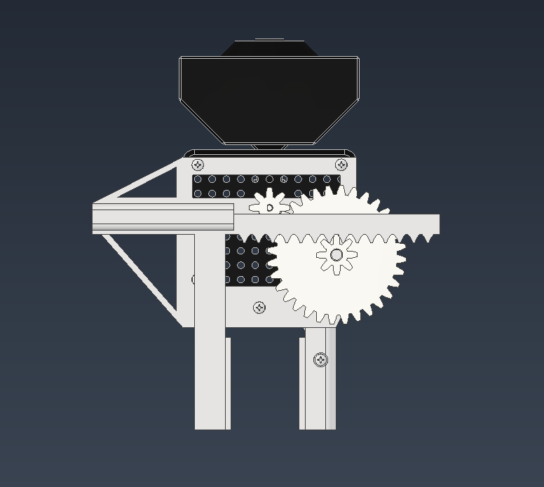
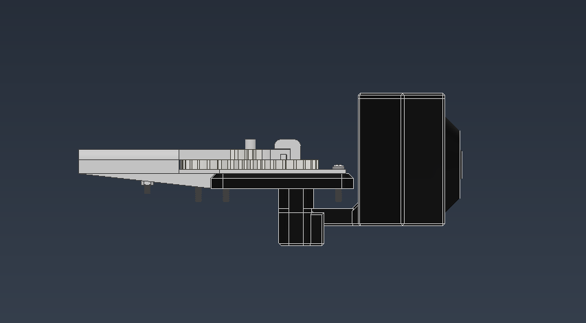

# ENG 1P13 Project 1 - QArm Packing System

For Engineering 1P13 Project 1, our team designed a custom end-effector attachment for the QArm robotic arm, along with a software system that enables workers to submit and process packing orders. The system integrates hardware, a product database, and user account management to streamline warehouse packing operations.

## Contributors

- Alexander Jando
- Brian Zuo
- Daniel Elmalak
- Jai Amoli
- Ryan Ji

## Software Features

- **User Accounts:** Workers can create personal accounts that are linked to all orders they submit.
- **Barcode Scanning:** A physical barcode scanner is used to quickly input and identify orders.
- **Product Database Integration:** The software checks product information and pricing from a dedicated database to determine the correct items to pack.
- **Order Management:** All orders are stored in a database for tracking, auditing, and future reference.
- **Automated Output:** The system generates detailed order receipts and summaries based on the submitted order data.

## Mechanism Pictures

To load the full model assembly in AutoDesk Inventor open the model/FullAssembly.iam file

### Isometric View

### Front View

### Top View

### Right View

